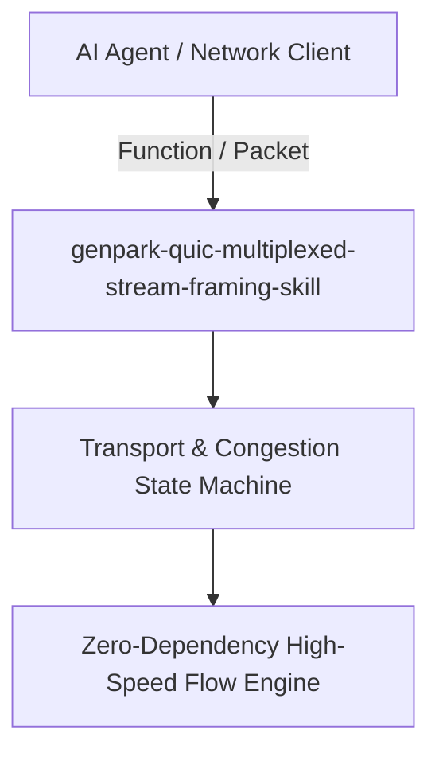

# genpark-quic-multiplexed-stream-framing-skill

[](https://github.com/alphaparkinc/genpark-quic-multiplexed-stream-framing-skill/actions)
[](https://opensource.org/licenses/MIT)
[](https://www.python.org/downloads/)

> QUIC transport layer framing engine providing stream multiplexing, variable-length integer encoding, packet serialization, and zero head-of-line blocking.

## Architecture



## Features
- Pure standard library Python implementation with strictly zero external pip dependencies.
- Production-grade networking algorithms designed for ultra-low latency and deterministic execution.
- Native Model Context Protocol (MCP) server support for AI agent orchestration.

## Installation

```bash
git clone https://github.com/alphaparkinc/genpark-quic-multiplexed-stream-framing-skill.git
cd genpark-quic-multiplexed-stream-framing-skill
```

## Quickstart

```bash
python example_usage.py
```
